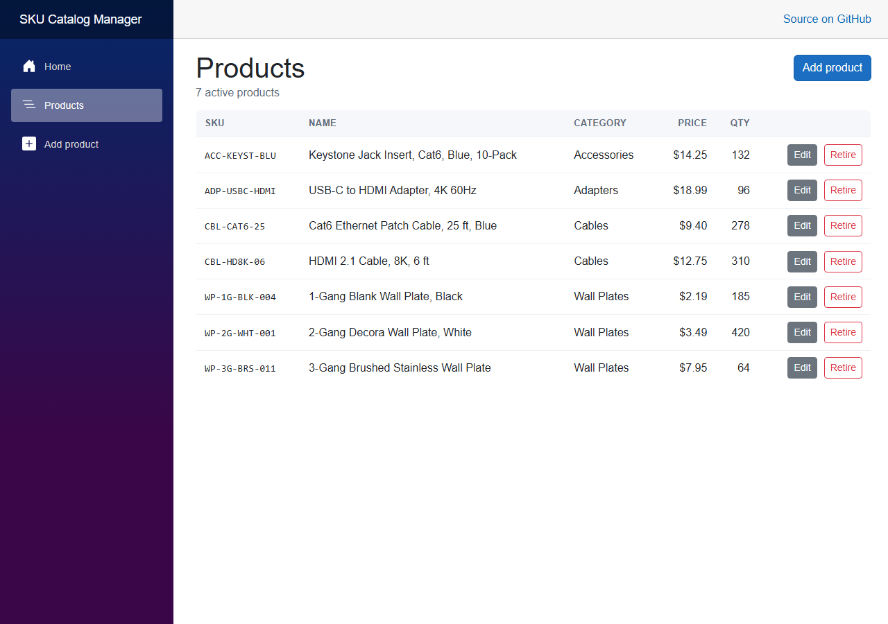
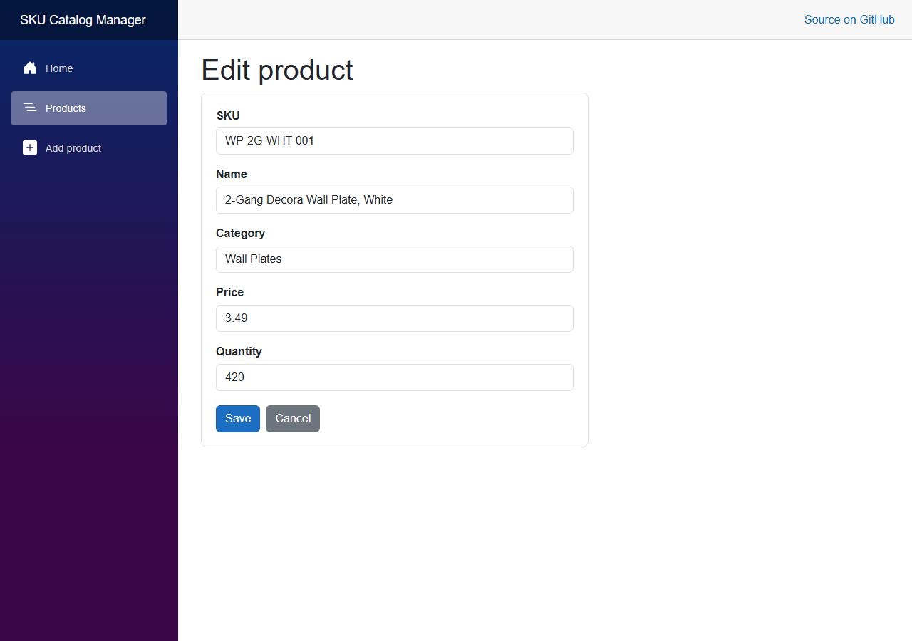

# SKU Catalog Manager

A small product catalog for the SKUs an e-commerce seller lists — add a product,
correct it, and retire it once it stops selling. Built to demonstrate EF Core and
SQL Server schema design in a .NET 10 Blazor Server application.



## The problem it solves

Small sellers keep their catalog in a spreadsheet until the spreadsheet stops being
trustworthy: the same SKU typed twice, prices stored as text, and rows deleted that
turn out to have been needed. This app puts the same data behind a real schema, so
the rules are enforced by the database rather than by whoever is editing the file.

- A duplicate SKU is rejected by a **unique index**, not by a screen that can be worked around
- Prices are **`decimal(18,2)`** — exact, never a floating point type
- Retiring a product **hides it and keeps the row**, so history survives

## Features

Implemented today:

- List active products with category, price and quantity
- Add a product, with server-side validation driven by data annotations
- Edit an existing product — an unknown id redirects rather than showing a broken form
- Retire a product (soft delete) behind a two-step confirm
- Duplicate SKUs are reported without discarding what was typed
- Responsive layout — the table becomes stacked cards at phone width

Not implemented: search, filtering, paging, authentication, and a screen for retired
products. See [Project status](#project-status).



## Technology stack

| Layer | Choice |
|---|---|
| Framework | .NET 10, Blazor Server (Interactive Server rendering) |
| UI | MudBlazor 9.9.0 |
| Data access | Entity Framework Core 10 |
| Database | SQL Server — LocalDB in development |

**There is no HTTP API in this project, and no Swagger/OpenAPI.** It is a
server-rendered Blazor application: the Razor components query EF Core directly
through an injected `IDbContextFactory<CatalogDbContext>`. There are no controllers
or minimal-API endpoints to call from outside the app.

## Solution structure

| Project | Holds |
|---|---|
| `SkuCatalog.Web` | Blazor Server app — routed pages, layout, MudBlazor theme, startup |
| `SkuCatalog.Data` | `CatalogDbContext`, the `Product` and `Category` models, EF Core migrations |

The project reference points **one way only**: Web references Data, never the reverse.

The context is registered with `AddDbContextFactory`, not `AddDbContext`. Blazor
Server components are long-lived and several can run at once, so each operation
creates its own short-lived context instead of sharing one. Sharing produces
intermittent "a second operation was started on this context" failures, and
retrofitting the factory later means touching every page.

## Requirements

- Visual Studio 2026 with the ASP.NET and web development workload
- .NET 10 SDK
- SQL Server LocalDB (installed with Visual Studio) — or any SQL Server instance

## Getting it running

1. Open `SkuCatalogManager.sln` in Visual Studio 2026.
2. Right-click **`SkuCatalog.Web`** → **Manage User Secrets**, and add a connection
   string named `CatalogDatabase` pointing at your LocalDB instance
   (`(localdb)\MSSQLLocalDB`) with the database named `SkuCatalogManager`.
   `appsettings.json` keeps the key with a blank value so the shape is documented
   without a credential in the repository.
3. Apply the migration. In **Package Manager Console** set **Default project** to
   `SkuCatalog.Data` **and** make sure the **startup project is `SkuCatalog.Web`** —
   the EF Core tools and the connection string both live there — then run:

   ```powershell
   Update-Database
   ```

4. Press F5 and open `/products`.

The database is **not** created automatically at startup; step 3 is required on a
fresh clone. Four starter categories are seeded by the migration, so the category
dropdown is never empty on first run.

Full setup detail, including the CLI equivalent of every step, is in
[docs/getting-started.md](docs/getting-started.md).

## Documentation

| Document | Covers |
|---|---|
| [docs/getting-started.md](docs/getting-started.md) | Setup from a fresh clone, how to verify it works, current deployment state |
| [docs/architecture.md](docs/architecture.md) | Projects, layers, rendering model, data access, page flow |
| [docs/database.md](docs/database.md) | Schema, entities, relationships, indexes, migrations, seed data, ER diagram |
| [docs/configuration.md](docs/configuration.md) | Every setting, where it comes from, User Secrets, environments |
| [docs/troubleshooting.md](docs/troubleshooting.md) | Setup, EF Core, data and UI problems specific to this app |

## Project status

Working and complete for what it sets out to prove: a real SQL Server schema, EF Core
migrations, a relationship between two tables, and screens that read and write. It is
a portfolio project rather than a product, and is not deployed to a public URL — it
runs locally against LocalDB.

What I would add next:

- Search and filter by category
- Server-side paging, once the catalog outgrows one page
- A view for retired products, with a way to bring one back
- Unit tests over the save logic

## License

MIT - see [LICENSE](LICENSE).

---

Self-directed portfolio project.
