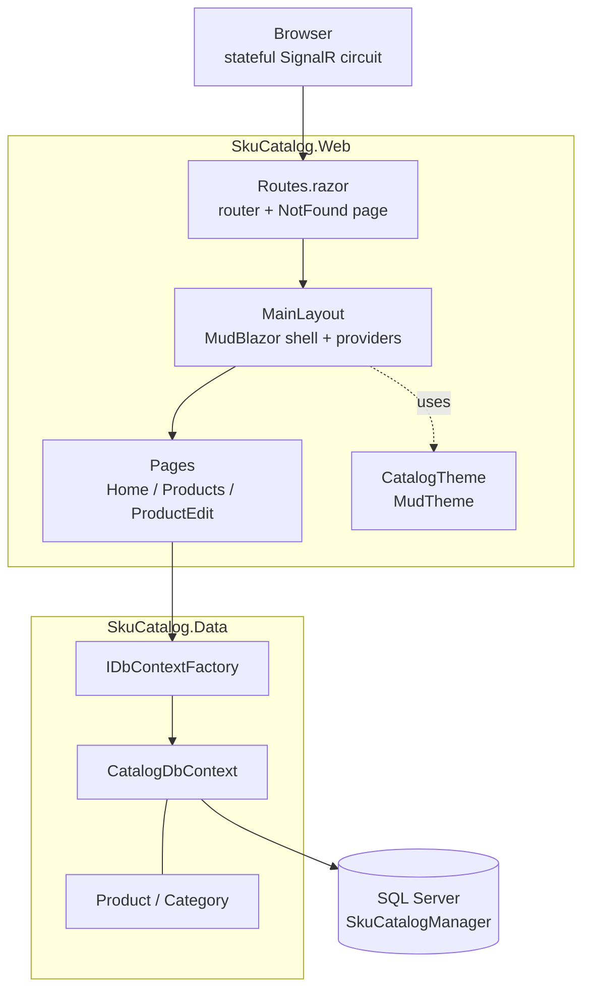

# Architecture

How SKU Catalog Manager is put together, and why it is arranged this way.

This describes the code as it exists today. Ideas that are not built are collected
under [Recommendations](#recommendations) at the end so they cannot be mistaken for
current behavior.

## Shape of the solution

Two projects, and the reference points one way only.

| Project | Type | Responsibility |
|---|---|---|
| `SkuCatalog.Web` | `Microsoft.NET.Sdk.Web` | Everything the user sees — routed pages, layout, theme, startup and configuration |
| `SkuCatalog.Data` | `Microsoft.NET.Sdk` class library | The domain models, `CatalogDbContext`, and EF Core migrations |

`SkuCatalog.Web` references `SkuCatalog.Data`. **`SkuCatalog.Data` references nothing
from the web project**, and must not — that one rule is what keeps the data layer
reusable and testable. A console tool or a test project could reference it tomorrow
without dragging Blazor in behind it.

## How a request flows



There is **no HTTP API layer**. No controllers, no minimal-API endpoints, no
Swagger/OpenAPI. Nothing outside the app calls into it — the browser holds a circuit,
and the components on the server do the work.

## Rendering model

Blazor Server with **Interactive Server** rendering, applied globally in `App.razor`:

```razor
<Routes @rendermode="InteractiveServer" />
```

Components run **on the server**. The browser holds a SignalR connection and receives
DOM diffs; events travel back over the same connection. Two consequences shape the
rest of the design:

- **Component state lives on the server between events.** When `ProductEdit` loads a
  product, that object stays in server memory across the user's typing and is still
  there at save time. This is why the edit form can post back only five fields and
  still write the original `CreatedUtc` — the loaded entity never left.
- **Connections drop.** `ReconnectModal.razor` is the stock overlay that appears while
  the circuit is rejoining. It is template code, kept as-is.

## Startup and pipeline

All configuration is in `Program.cs` — there is no `Startup.cs`.

Services registered:

| Registration | Purpose |
|---|---|
| `AddRazorComponents().AddInteractiveServerComponents()` | Blazor Server |
| `AddMudServices()` | MudBlazor — required for dialogs, snackbars, popovers |
| `AddDbContextFactory<CatalogDbContext>(...UseSqlServer(...))` | Data access, see below |

Pipeline, in order:

1. `UseExceptionHandler("/Error")` and `UseHsts()` — **non-development only**
2. `UseStatusCodePagesWithReExecute("/not-found")`
3. `UseHttpsRedirection()`
4. `UseAntiforgery()`
5. `MapStaticAssets()`
6. `MapRazorComponents<App>().AddInteractiveServerRenderMode()`

Note what is **absent**: no `Migrate()` or `EnsureCreated()` call. The app never
creates or upgrades its own database. See
[database.md](database.md#database-initialization).

## Data access

`IDbContextFactory<CatalogDbContext>` is injected straight into the Razor components,
and each operation opens its own short-lived context:

```csharp
await using var db = await DbFactory.CreateDbContextAsync();
```

**The factory is not a stylistic choice.** Blazor Server components are long-lived and
several can be running at once, so a single scoped `DbContext` gets shared across
overlapping operations and throws *"a second operation was started on this context"*
intermittently — the worst kind of bug, because it depends on timing.

### There is no service or repository layer, on purpose

Components hold their own queries. `Products.razor` builds its own LINQ; `ProductEdit`
does its own `Add`/`Update`/`SaveChangesAsync`.

For an app of this size that is the honest structure: a repository wrapping EF Core
would be a second abstraction over something that is already an abstraction, and would
add indirection without removing any. `DbSet<T>` and `IQueryable<T>` are the
repository.

The point at which this stops being true is written up under
[Recommendations](#recommendations).

## Pages and routing

| Route | Component | Does |
|---|---|---|
| `/` | `Pages/Home.razor` | Landing page describing the app |
| `/products` | `Pages/Products.razor` | Lists active products; retire with a two-step confirm |
| `/products/new` | `Pages/ProductEdit.razor` | Create — same component, no `Id` |
| `/products/edit/{Id:int}` | `Pages/ProductEdit.razor` | Edit — loads by route parameter |
| `/not-found` | `Pages/NotFound.razor` | Re-executed target for non-200 status codes |
| `/Error` | `Pages/Error.razor` | Unhandled exception page, non-development only |

Routing is set up in `Routes.razor`, which also wires `NotFoundPage` and focuses the
`h1` after navigation for screen-reader users.

**One component serves both create and edit.** `ProductEdit` carries two `@page`
directives and branches on whether `Id` is null. The form, the validation and the save
path are therefore identical for both, which is why a field added to one is never
missing from the other.

## UI layer

MudBlazor 9.9.0 throughout. `MainLayout.razor` hosts the four providers MudBlazor
needs — `MudThemeProvider`, `MudPopoverProvider`, `MudDialogProvider`,
`MudSnackbarProvider` — plus the app bar, the responsive drawer, and `MudMainContent`.

`CatalogTheme.cs` holds the `MudTheme`: indigo primary, Roboto, 10px radius, elevated
surfaces. It is a separate static class rather than inline markup so the whole look is
in one file.

**Do not put a `pt-*` class on `MudMainContent`.** It overrides the padding MudBlazor
uses to clear the fixed app bar, and the page slides underneath it. Spacing belongs on
the inner `MudContainer`. There is a comment in `MainLayout.razor` saying so, because
this was hit once already.

## Validation

Two layers, both server-side:

1. **Data annotations on the model** (`SkuCatalog.Data/Models/Product.cs`) drive the
   form through `<DataAnnotationsValidator />`. `[Required]`, `[MaxLength]`, `[Range]`.
2. **The database** enforces what annotations cannot — the unique SKU index and the
   foreign key. `ProductEdit` catches `DbUpdateException` and turns it into a message.

The interesting one is `[Range(1, int.MaxValue)]` on `CategoryId`. The select's
placeholder option has value `0`, so the range attribute is what stops "-- choose a
category --" being submitted.

## Error handling

| Situation | Handling |
|---|---|
| Unhandled exception | `UseExceptionHandler("/Error")` — production only; development shows the developer exception page |
| Unknown URL | `UseStatusCodePagesWithReExecute("/not-found")` |
| Unknown product id | `ProductEdit` redirects to `/products` rather than rendering an empty form |
| Duplicate SKU | `DbUpdateException` whose inner `SqlException` is 2601/2627; message shown, typed values kept |
| Any other save failure | Generic message on screen, real exception written to the log |
| Circuit dropped | `ReconnectModal` overlay |

`BlazorDisableThrowNavigationException` is set to `true` in the csproj, so
`NavigateTo` during a lifecycle method does not throw the navigation exception that
.NET 9 introduced.

## Authentication and external services

**Neither exists.** No authentication, no authorization, no identity, no external API
calls, no email, no file storage, no message queue. The only thing the app talks to is
its own SQL Server database.

Worth stating explicitly: every page is public, and the app is intended to run locally.

## Patterns actually in use

- **Separated data project** with a one-way reference
- **Factory-per-operation** for `DbContext`, forced by the Blazor Server model
- **Soft delete** via `IsActive`, with the list query filtering on it
- **Shared create/edit component** driven by an optional route parameter
- **Theme as a typed object** rather than scattered CSS overrides
- **`AsNoTracking` on read paths** — nothing is tracked unless it is going to be saved

Not used, and not needed here: repository, unit of work, CQRS, MediatR, AutoMapper,
DTOs. Every one of them would add a layer without removing a problem this app has.

## Recommendations

**None of the following is implemented.** These are the things worth doing if the app
grows, listed so the gap between "current" and "possible" stays visible.

| Recommendation | Why |
|---|---|
| Move query logic into a `ProductService` in the Data project | Only worth it once a second screen needs the same query, or the save logic needs testing without a browser |
| Add a test project | There is none. The save path and the soft-delete filter are the obvious first targets |
| Add a concurrency token | Two people editing the same product silently overwrite each other |

### Cleanup done while documenting

Writing these docs surfaced three leftovers from before the MudBlazor restyle. All
three are **fixed** — recorded here because the reasoning is worth keeping.

1. **`wwwroot/lib/bootstrap/` was dead weight** — 16 CSS files that nothing
   referenced. `App.razor` links only `app.css`, the scoped stylesheet, Roboto and
   MudBlazor. Deleted.
2. **`Error.razor` styled its headings with `text-danger`**, a Bootstrap class, in an
   app where Bootstrap is not linked — so it resolved to nothing and the headings
   rendered in the default color instead of red. That was the concrete cost of keeping
   the dead folder: it was not only unused files, something rendered wrong because of
   it. Both `Error.razor` and `NotFound.razor` are now MudBlazor pages consistent with
   the rest of the app.
3. **`app.css` was the stock template stylesheet** plus a hand-written table and form
   layout from the pre-MudBlazor UI. Every rule was verified unused before removal: no
   markup referenced the custom classes, and MudBlazor's inputs carry only `mud-*`
   classes, so even the EditForm validation hooks (`.valid`, `.modified`, `.invalid`)
   matched nothing. Reduced to a comment explaining where styling actually lives.

**`#blazor-error-ui` was checked before touching any of this** — it is styled by
MudBlazor and the framework, not by `app.css`, so it is still correctly hidden.
