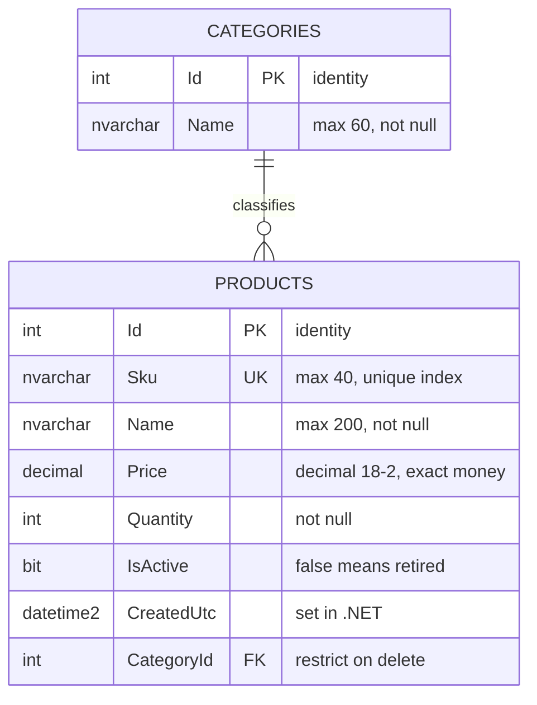

# Database

How SKU Catalog Manager stores its data: the schema, the EF Core configuration behind
it, and the behavior that follows from both.

Everything here describes the code as it exists. Anything not yet built is kept in
[Not implemented](#not-implemented) at the end, so it cannot be mistaken for current
behavior.

## At a glance

| | |
|---|---|
| Engine | SQL Server (LocalDB in development) |
| ORM | Entity Framework Core 10.0.11, SQL Server provider |
| Context | `CatalogDbContext` in `SkuCatalog.Data` |
| Tables | `Categories`, `Products` |
| Migrations | One — `20260825182049_InitialCreate` |
| Seed data | Four categories, inserted by the migration |
| Auto-created at startup | **No** — the migration must be applied manually |

## Connection

The connection string is named **`CatalogDatabase`** and the database is named
**`SkuCatalogManager`**.

It is read in `Program.cs`:

```csharp
builder.Services.AddDbContextFactory<CatalogDbContext>(options =>
    options.UseSqlServer(
        builder.Configuration.GetConnectionString("CatalogDatabase")));
```

The real value lives in **User Secrets only**. `appsettings.json` carries the key with
an empty string so the setting's shape is documented without putting a credential in
the repository:

```json
"ConnectionStrings": {
  "CatalogDatabase": ""
}
```

Development uses `(localdb)\MSSQLLocalDB` with a trusted connection. Production would
use the same provider with a different string — the provider never changes, only the
connection. Configuration is documented in full in the configuration guide (not yet written).

## Why the context is registered as a factory

`AddDbContextFactory`, not `AddDbContext`. Blazor Server components are long-lived and
several can be doing work at the same moment, so a single scoped context gets shared
across overlapping operations and throws *"a second operation was started on this
context"* intermittently. Every page here opens its own short-lived context instead:

```csharp
await using var db = await DbFactory.CreateDbContextAsync();
```

This is worth getting right at the start — retrofitting the factory later means
editing every page that touches data.

## Entities

Both live in `SkuCatalog.Data/Models`. Column types below are the types the migration
actually creates.

### Product

| Property | CLR type | Column | Rules |
|---|---|---|---|
| `Id` | `int` | `int`, identity, PK | |
| `Sku` | `string` | `nvarchar(40)`, not null | **Unique index.** Required, max length 40 |
| `Name` | `string` | `nvarchar(200)`, not null | Required, max length 200 |
| `Price` | `decimal` | `decimal(18,2)`, not null | Range 0–999,999 |
| `Quantity` | `int` | `int`, not null | Range 0–100,000 |
| `IsActive` | `bool` | `bit`, not null | Defaults to `true`; `false` means retired |
| `CreatedUtc` | `DateTime` | `datetime2`, not null | Set in .NET, not by the database |
| `CategoryId` | `int` | `int`, not null, FK | Must be 1 or greater, so the placeholder option fails validation |
| `Category` | `Category?` | — | Navigation property |

`Price` is `decimal`, never `double` or `float`. Money has to be exact, and it is
mapped explicitly in `OnModelCreating` because SQL Server would otherwise pick a
default that loses precision.

`CategoryId` carries `[Range(1, int.MaxValue)]` specifically so the form's
"-- choose a category --" option, whose value is `0`, fails validation instead of
saving a row pointing at a category that does not exist.

### Category

| Property | CLR type | Column | Rules |
|---|---|---|---|
| `Id` | `int` | `int`, identity, PK | |
| `Name` | `string` | `nvarchar(60)`, not null | Required, max length 60 |
| `Products` | `List<Product>` | — | Collection navigation; EF Core reads this to build the relationship |

## Schema



One category has many products. A product must have exactly one category.

## Relationship and delete behavior

Configured explicitly rather than left to convention:

```csharp
modelBuilder.Entity<Product>()
    .HasOne(p => p.Category)
    .WithMany(c => c.Products)
    .HasForeignKey(p => p.CategoryId)
    .OnDelete(DeleteBehavior.Restrict);
```

`Restrict` means **a category that still has products cannot be deleted**. The
database refuses it. Without this, EF Core's default for a required relationship is
cascade delete, and removing a category would silently take its products with it.

## Indexes

| Index | Table | Columns | Unique |
|---|---|---|---|
| `PK_Categories` | `Categories` | `Id` | yes |
| `PK_Products` | `Products` | `Id` | yes |
| `IX_Products_Sku` | `Products` | `Sku` | **yes** |
| `IX_Products_CategoryId` | `Products` | `CategoryId` | no |

`IX_Products_Sku` is the point of the whole app. The duplicate-SKU rule is enforced by
the database, so it holds no matter what the UI does — a bulk import, a direct SQL
insert, or two people saving at the same instant all hit the same constraint.

### One consequence worth knowing

**`IX_Products_Sku` has no filter, so it covers retired products too.** Retiring a
product sets `IsActive = false` but leaves the row in place, and that row keeps its
SKU reserved. Trying to create a new product reusing a retired SKU fails with the
duplicate-SKU message, even though the old product is invisible on the list screen.

That is a deliberate consequence of soft delete rather than a defect — the SKU really
is still in use by a record that still exists. If reusing SKUs is ever wanted, the fix
is a filtered unique index (`WHERE IsActive = 1`), which is a schema change and a new
migration.

## Migrations

One migration exists: **`20260825182049_InitialCreate`**, in
`SkuCatalog.Data/Migrations`. It creates both tables, both indexes, the foreign key
with `ReferentialAction.Restrict`, and inserts the seed categories.

Migrations live in `SkuCatalog.Data`, but the EF Core tools and the connection string
live in `SkuCatalog.Web`. Both facts matter when running commands.

**Package Manager Console** — set Default project to `SkuCatalog.Data`, and the
solution's startup project to `SkuCatalog.Web`:

```powershell
Update-Database
Add-Migration <Name>
```

**CLI** — from the solution folder, naming both projects explicitly:

```bash
dotnet ef database update --project SkuCatalog.Data --startup-project SkuCatalog.Web
dotnet ef migrations add <Name> --project SkuCatalog.Data --startup-project SkuCatalog.Web
```

Getting "Unable to create an object of type 'CatalogDbContext'" almost always means
the startup project is wrong, so the tools cannot find the connection string.

## Seed data

Four categories are inserted through `HasData` in `OnModelCreating`, which the
migration turns into `InsertData`:

| Id | Name |
|---|---|
| 1 | Wall Plates |
| 2 | Cables |
| 3 | Adapters |
| 4 | Accessories |

They exist so the category dropdown is never empty on a fresh database. Because they
are seeded through `HasData` with fixed ids, EF Core manages them — changing a name
here produces an `UpdateData` line in the next migration rather than a duplicate row.

## Database initialization

There is **no** `EnsureCreated()` and **no** `Migrate()` call in `Program.cs`. The app
does not create or update the database when it starts.

A fresh clone therefore needs `Update-Database` run by hand before the app works.
Skipping it produces a SQL "cannot open database" error on the first page that queries
data, not a friendly message.

This is deliberate for a development app: applying migrations automatically at startup
is convenient locally but risky anywhere else, because the app would alter the schema
on deploy without anyone choosing to.

## How the application reads and writes

There is no repository or service layer. Razor components inject
`IDbContextFactory<CatalogDbContext>` and query EF Core directly.

**Reading the list** (`Products.razor`):

```csharp
products = await db.Products
    .AsNoTracking()
    .Include(p => p.Category)
    .Where(p => p.IsActive)
    .OrderBy(p => p.Sku)
    .ToListAsync();
```

`AsNoTracking` because these rows are displayed, not edited — no change tracker is
needed. `Include` loads the category so the grid can show its name without a query per
row. `Where(p => p.IsActive)` is what makes retired products disappear.

**Retiring** flips the flag and saves. The row is never deleted:

```csharp
product.IsActive = false;
await db.SaveChangesAsync();
```

**Saving** (`ProductEdit.razor`) branches on the id — `Add` for a new product,
`Update` for an existing one — then handles `DbUpdateException`.

Two details of that path worth knowing:

- `Update()` marks **every** column modified, including `CreatedUtc`. The value
  survives because the form edits the entity that was loaded from the database, so the
  original timestamp is still on the object when it is saved back.
- **The duplicate-SKU message is matched on the SQL error number**, not assumed. A
  `DbUpdateException` whose inner `SqlException` is 2601 or 2627 — SQL Server's unique
  index and unique constraint violations — produces "SKU 'X' is already in use." Any
  other save failure gets a plain "Could not save this product" and the real exception
  is written to the log, so a timeout is never disguised as a duplicate.

## Not implemented

Recommendations and known gaps. **None of the following is in the code today.**

- **A filtered unique index** on `Sku`, if retired SKUs should ever become reusable.
- **Paging.** The list query loads every active product in one go.
- **Search and filtering**, including by category.
- **A retired-products view**, with a way to reactivate a row.
- **Concurrency control.** No `rowversion` column, so two people editing the same
  product will silently overwrite each other — last save wins.
- **`CreatedUtc` as a database default.** It is currently set in .NET, so a row
  inserted by any other route gets no timestamp.
